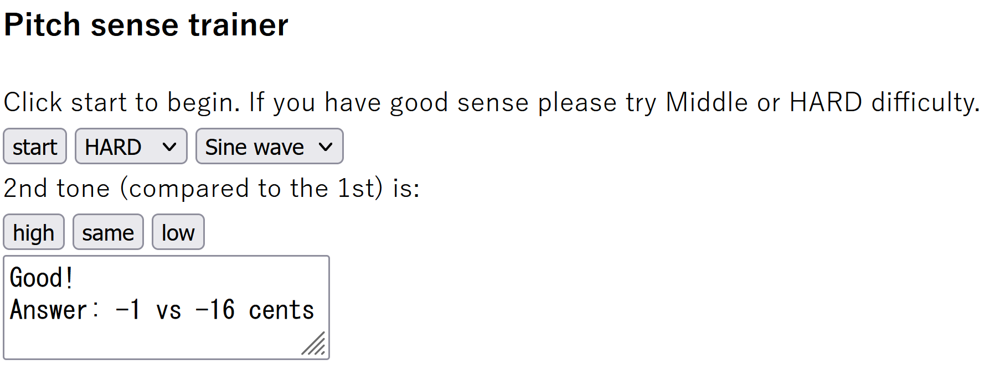

# Pitchsense-trainer
Try on: <a href="https://ys-clarry.github.io/Pitchsense-trainer/">https://ys-clarry.github.io/Pitchsense-trainer/</a>

Listen and train your sense of (relative) pitch, which is very important for musicians.

